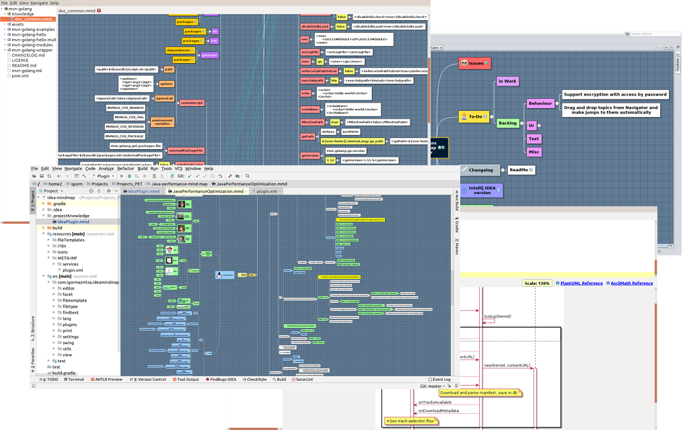

  

[](http://www.apache.org/licenses/LICENSE-2.0)
[](http://www.oracle.com/technetwork/java/javase/downloads/index.html)
[](http://plugins.netbeans.org/plugin/60188/nb-mindmap-editor)
[](https://plugins.jetbrains.com/plugin/8045)
[](https://www.paypal.com/cgi-bin/webscr?cmd=_s-xclick&hosted_button_id=AHWJHJFBAWGL2)
[](https://yoomoney.ru/to/41001158080699)

# Introduction
The Main part of a software project is not code but knowledge generated during the project. I guess knowledge is the main part of every business today and it is very important to move the generated knowledge from non-formal level to formal level to avoid its loss. There are many approaches to save knowledge and [a mind map diagram](https://en.wikipedia.org/wiki/Mind_map) is one of them. Also it is very important to keep the "distance" between project and its knowledge as short as possible and the ideal variant is to keep knowledge just within the project as a document set. If you use any external knowledge engineering tool then the distance already is not so short and for the cause I had decided to develop some plugin which would allow to form mind maps and keep knowledge graph just within projects and allow to work with the graphs just with the IDE.   

Initially I developed a plugin for NetBeans IDE then the IntellijIDEA plugin was developed. I have a friend who is not from Java world but he also wanted to use the too so that Scia Reto editor was written.   


# Changelog

__1.6.7 (SNAPSHOT)__
- IJ:  Minimal supported Intellij IDEA platform lifted up to 2022.2 (Build: 222.3345.118)
- IJ:  Fixed scope for MMD files
- IJ:  Plugin renamed to 'SciaReto Mind Map' by requirement of JetBrains
- SR:  Added version for Linux ARM (aarch64)
- SR:  Embedded JDK updated to 22.0.1+12
- SR:  PlantUML updated to 1.2024.5

__1.6.6 (11-feb-2024)__
- SR:  PlantUML updated to 1.2024.1
- SR: Added option to keep non-saved documents between sessions
- SR: Embedded JDK updated to 21.0.2+14
- IJ: Added `MMD Files` view panel
- IJ: Minimal supported Intellij IDEA platform lifted up to 202.8194.7
- AP: improved annotation processor to find and extract marks in method bodies
- SR: embedded Intellij fonts (`JetBrains Mono Kawkab` and `JetBrains Mono Vazir`) with Farsi char-set support [#120](https://github.com/raydac/netbeans-mmd-plugin/issues/120)
- IJ,NB: Improved font configuration use for Note text editor [#120](https://github.com/raydac/netbeans-mmd-plugin/issues/120)


[Full changelog](https://github.com/raydac/netbeans-mmd-plugin/blob/master/changelog.txt)   

# Implementation

All parts of the application are written in Java and it needs Java 1.8+ for work.   

The editor has three implementations
- standalone editor (including also [PlantUML](http://plantuml.com/) support) [Scia Reto](https://sciareto.org)
- [NetBeans plug-in](https://plugins.netbeans.apache.org/catalogue/?id=56)
- [Intellij IDEA plug-in](https://plugins.jetbrains.com/plugin/8045-idea-mind-map)   
The standalone version is a Java application but it contains embedded JRE so that a user should not have pre-installed Java on computer. But [Graphviz](https://www.graphviz.org/download/) may be required for some PlantUML diagrams.

# How to use?

Just after first release for NetBeans IDE, [Geertjan Wielenga created nice screen-cast](https://www.youtube.com/watch?v=7TUU25dsOfM) which a bit out of date but still look good to understand common idea. It is very easy editor and the main set of operations look very intuitive, main questions from users I had about keyboard shortcuts but if keep in mind that __TAB__ creates new mind map node and __ENTER__ creates new sibling mode then life becomes much easier. It is a pop-up menu centric software so that all operations accessible through pop-up menu.

# Key features
## Data format
The Plugin keeps all mind map information in single UTF8 encoded plain text file formed in markdown compatible format, so the file can be easily read and interpret and without the plug-in.  

```
Mind Map generated by NB MindMap plugin   
> __version__=`1.1`
---

# Root <br/>topic
> topicLinkUID=`14F9D4CD31DA`


## First level
- LINK
<pre>http://www.google.com</pre>

### Item 1\.1
- NOTE
<pre>Some note for item 1.1</pre>

### Item 1\.2
- TOPIC
<pre>14F9D4CD31DA</pre>
```

## How to create new Mind map
### SciaReto standalone application
In project tree just click mouse to activate pop-up menu for a folder and select in menu __New->Mind map__.
  

### NetBeans
Mind map type is added as one more file type and can be found among file types in the __Other__.   
  

### Intellij IDEA
Mind map type is registered as a file type which can be created through __New__ pop-up menu for a folder.
  

## Work with mind maps
Mind maps are opened in IDE as documents with graphic interface and the plugin doesn't add any new actions into IDE menu so all operations over mind maps you can make through the document pop-up menu. The Pop-up menu is formed for the current document state and context.  
  

## Move topics
All manipulations over topic order and its position in the map hierarchy can be made only through mouse Drag&Drop operations (keep in mind that only one topic can be moved in the same time).  
  

## Tune look of mind map editor
You can tune most of graphic parameters for mind map rendering through special panel __Options__. It can be activated through __Options__ item of pop-up menu and through menu __Edit->Preferences__ in the standalone version.  
  

## Export mind map data
Today it is very important to have way to export data to another formats to use the knowledge in another tools. The Plug-in supports several formats to export data:  

- __Plain text__ format
- __Markdown__ format
- __Freemind__ format
- __Mindmup__ format
- __PNG__ image
- __SVG__ image
- __ORG__ format

## Import data as Mind map
At present the editor allows to import main maps from many well-known mind map formats
- __Mindmup__ format
- __Freemind__ format
- __XMind__ format
- __Coggle__ format
- __Novamind__ format
also it can import mind map from tabbed text files.

## Content alowed in mind maps
Mainly you can keep short texts in your mind maps as topic names but sometime it is useful to keep and another information, the plugin allows to keep below listed information assets:

-  __Short text__ - short text in one or two lines as topic name, mainly used as id for the topic.
-  __Long text__ - long text information which can be opened and edited in special editor.
-  __URL link__ - just URL link to be opened in system browser
-  __File link__ - link to a file, youc can add them through special dialog or just drag and drop file from NetBeans project tree to a topic, **the file will be opened within IDE as a document**
-  __Transition__ - link to another topic in the same mind map, it allows to make some navigation in very big mind maps

You can add and edit new topic content through the mind map pop-up menu and if you want remove some content then just open editor for the content and remove all text information.
